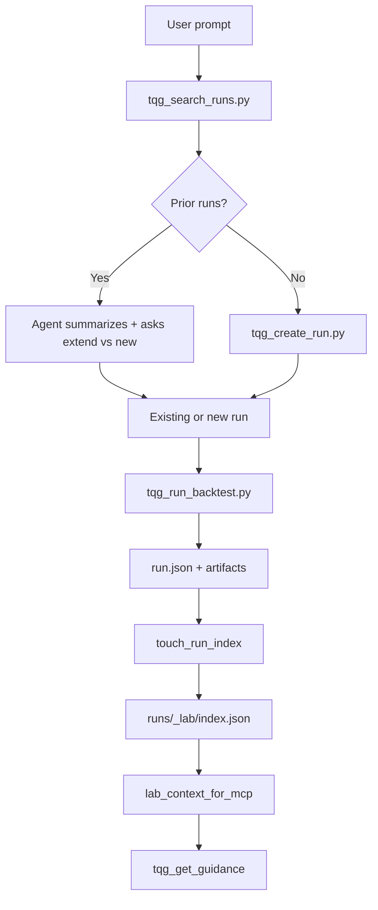

# Cross-Run Memory — Implementation Plan

## Goal

Turn isolated `runs/<id>/` folders into a **searchable lab memory** so agents (and you, from your phone) can answer:

- "What have we already tried on BTC momentum?"
- "Show runs where OOS Sharpe < 0.2"
- "Don't re-baseline — extend run `triangular_pairs`"
- "What failed last month and why?"

This is the gap between **folder structure** (copyable) and **institutional memory** (sticky).

---

## Current state (gap analysis)

| What exists | What it gives you | What's missing |
|-------------|-------------------|----------------|
| `run.json` | Per-run status, OOS, artifacts, steps | No cross-run view |
| `strategy_spec.json` | Canonical params, symbol, workflow | Not indexed |
| `artifacts/metrics.json` | IS/OOS Sharpe, CAGR, MaxDD | Not queryable across runs |
| `flow.json` | Turn log (optional) | Often empty; not searched |
| `report.md` | Human verdict | Not structured or indexed |
| `run_context_for_mcp()` | Sends one run to MCP | No lab-wide context |

**Key insight:** You don't need a database for v1. A **derived index file** rebuilt incrementally is enough — same pattern as `runs/.next_id`.

---

## Target architecture

```text
runs/
  _lab/
    index.json          # master registry (all runs, summary cards)
    index.meta.json     # schema version, last full rebuild, run count
  triangular_pairs/     # unchanged per-run layout
  qqq_pullback_reversal/
  ...
```

### Index entry schema (per run)

Each run gets a **summary card** — small, stable, query-friendly:

```json
{
  "run_id": "triangular_pairs",
  "title": "Triangular pairs (Binance perps)",
  "created_at": "2026-08-04T22:07:05+00:00",
  "updated_at": "2026-08-05T05:13:40+00:00",
  "status": "baseline_complete",
  "symbol": "UNIVERSE",
  "asset_class": "crypto",
  "workflow": "multi_asset_triangular_pairs",
  "strategy_type": "MEAN_REVERSION",
  "interval": "1d",
  "oos_start_ts": "2025-01-01T00:00:00+00:00",
  "validation_passed": true,
  "completed_steps": ["baseline"],
  "metrics": {
    "in_sample": { "Sharpe": 0.64, "CAGR": 0.11, "MaxDD": -0.29 },
    "out_of_sample": { "Sharpe": 1.66, "CAGR": 0.09, "MaxDD": -0.03 }
  },
  "params_fingerprint": "multi_asset_triangular_pairs|MEAN_REVERSION|UNIVERSE|1d|n_triangles=10|window=120|...",
  "verdict": null,
  "tags": [],
  "related_runs": [],
  "turn_count": 0,
  "last_user_prompt": null,
  "report_excerpt": "Hourly variants scored negative IS composite...",
  "paths": {
    "root": "runs/triangular_pairs",
    "report": "runs/triangular_pairs/report.md",
    "metrics": "runs/triangular_pairs/artifacts/metrics.json"
  }
}
```

### New optional per-run fields

Add to `run.json` (or a sidecar `runs/<id>/lab_meta.json` to avoid breaking existing schema):

| Field | Purpose |
|-------|---------|
| `verdict` | `promising` \| `no_edge` \| `killed` \| `needs_robustness` \| `packaged` |
| `tags` | `["btc", "momentum", "negative_result"]` |
| `related_runs` | `["qqq_pullback_reversal"]` — follow-ups, variants |
| `hypothesis` | One-line research question |
| `kill_reason` | Why abandoned (powers dedup warnings) |

---

## Phased rollout

### Phase 1 — Index core (foundation)

**Deliverable:** Build and maintain `runs/_lab/index.json` from existing runs.

| Task | Files / changes |
|------|-----------------|
| New module `tqg_client/lab_index.py` | `extract_run_card(run_id) -> dict`, `load_index()`, `save_index()`, `upsert_run()`, `remove_run()` |
| Card extraction logic | Read `run.json`, `strategy_spec.json`, `artifacts/metrics.json`, `flow.json`, first 500 chars of `report.md` |
| Params fingerprint | Hash normalized `(workflow, strategy_type, symbol, interval, sorted params)` for dedup |
| Backfill script | `scripts/tqg_rebuild_lab_index.py` — scan all `runs/*/` (skip `_lab`) |
| Config | Optional `lab_index_dir: ./runs/_lab` in `config.example.yaml` |

**Acceptance criteria:**

- `python scripts/tqg_rebuild_lab_index.py` produces index for all runs with `run.json`
- Index entry matches ground truth for `triangular_pairs`
- Handles missing `metrics.json` / `strategy_spec.json` gracefully

---

### Phase 2 — Incremental updates (keep index fresh)

Hook index updates into existing lifecycle scripts so rebuild is only needed for repair.

| Hook point | When to call `upsert_run(run_id)` |
|------------|-----------------------------------|
| `scripts/tqg_create_run.py` | After folder scaffold |
| `scripts/tqg_run_backtest.py` | After `save_run_state()` |
| `scripts/tqg_update_run_state.py` | After any state change |
| `scripts/tqg_record_turn.py` | After append (update `turn_count`, `last_user_prompt`) |
| `scripts/tqg_package_artifacts.py` | Set `verdict: packaged` or bump status |

**Implementation pattern:**

```python
# tqg_client/lab_index.py
def touch_run_index(run_id: str) -> None:
    """Best-effort upsert; never fail the parent script."""
    try:
        upsert_run(run_id)
    except Exception:
        log.warning("lab index update failed for %s", run_id)
```

Call `touch_run_index()` at the end of each script — failures must not break backtests.

**Acceptance criteria:**

- New run appears in index without manual rebuild
- PSA completion updates `status`, `metrics`, `completed_steps` in index

---

### Phase 3 — Search & query CLI

**Deliverable:** `scripts/tqg_search_runs.py` for humans and agents.

```bash
# Examples
python scripts/tqg_search_runs.py --symbol BTCUSDT
python scripts/tqg_search_runs.py --workflow mean_reversion
python scripts/tqg_search_runs.py --oos-sharpe-lt 0.3
python scripts/tqg_search_runs.py --verdict no_edge
python scripts/tqg_search_runs.py --tag momentum
python scripts/tqg_search_runs.py --text "pullback"
python scripts/tqg_search_runs.py --related-to triangular_pairs
python scripts/tqg_search_runs.py --json  # machine-readable for agents
```

| Filter | Source field |
|--------|--------------|
| `--symbol`, `--asset-class`, `--workflow`, `--strategy-type` | Index card |
| `--status`, `--validation-passed` | Index card |
| `--is-sharpe-gt/lt`, `--oos-sharpe-gt/lt` | `metrics.*` |
| `--verdict`, `--tag` | `lab_meta` / index |
| `--text` | Search title, hypothesis, report_excerpt, flow summaries |
| `--since`, `--until` | `created_at` / `updated_at` |
| `--fingerprint-match` | Warn if near-duplicate params exist |

Also add:

```bash
python scripts/tqg_lab_context.py --for-mcp [--limit 10] [--symbol QQQ]
```

Returns a compact JSON blob suitable for MCP `run_context` extension.

**Acceptance criteria:**

- Agent can run one command and get relevant prior runs before starting new work
- Duplicate warning when fingerprint matches an existing `no_edge` run

---

### Phase 4 — Agent & MCP integration

#### 4a. Skills & rules (client-side, ships with wrapper)

| File | Update |
|------|--------|
| `.cursor/skills/tqg-research-session/SKILL.md` | **Before coding:** run `tqg_search_runs.py` for symbol/workflow; if matches found, summarize and ask user whether to extend vs. new run |
| `.cursor/rules/30-run-isolation.mdc` or new `35-lab-memory.mdc` | Mandate cross-run search before new baselines; prefer `related_runs` links |
| `AGENTS.md` | Document lab memory commands |

#### 4b. Enforce `flow.json` recording

Today `flow.json` is optional and often empty. Make it part of the memory layer:

| Change | Detail |
|--------|--------|
| Auto-record in `tqg_run_backtest.py` | Append turn with `--user-request` when provided |
| Skill update | Require `tqg_record_turn.py` after significant user prompts |
| Index field | `last_user_prompt` from latest flow turn |

#### 4c. MCP payload extension

Extend what goes to MCP (client change now; server can consume later):

```python
# tqg_client/mcp_helpers.py
def lab_context_for_mcp(*, symbol: str | None = None, limit: int = 8) -> dict:
    return {
        "prior_runs": search_runs(symbol=symbol, limit=limit),
        "duplicate_warnings": find_fingerprint_matches(symbol=symbol),
        "index_updated_at": index_meta["updated_at"],
    }
```

Pass alongside existing `run_context` in `tqg_get_guidance` calls. Server-side MCP can later use this for smarter hints ("you already killed this hypothesis in run 5").

**Acceptance criteria:**

- New strategy request on QQQ surfaces `qqq_pullback_reversal` automatically
- MCP guidance references prior runs when relevant

---

### Phase 5 — Verdicts, relationships, dedup (memory quality)

This is what makes memory **actionable**, not just a list.

| Feature | Implementation |
|---------|----------------|
| Set verdict | `python scripts/tqg_tag_run.py <run_id> --verdict no_edge --reason "768-config grid, no stable cells"` |
| Link runs | `--related-to <other_run_id>` |
| Dedup guard | `tqg_search_runs.py --fingerprint-of <run_id>` before baseline |
| Auto-verdict heuristics (optional) | If `oos Sharpe < 0` and PSA complete → suggest `no_edge` in report |

Add `verdict` / `tags` / `related_runs` to packaged `manifest.json` so reports carry institutional memory.

**Acceptance criteria:**

- Agent can mark a run killed and future searches surface it
- Related-run graph visible in index

---

### Phase 6 — Optional enhancements (v2)

| Enhancement | When to add |
|-------------|-------------|
| SQLite backend (`runs/_lab/index.sqlite`) | >100 runs or slow text search |
| Embedding search on reports | When `--text` grep isn't enough |
| Web dashboard | Client-facing "research journal" |
| MCP tool `tqg_search_lab` | Server-native search (keeps query logic proprietary) |
| Git-aware index | Track which commit produced each run |

**Recommendation:** Ship Phases 1–4 before any of these.

---

## File change summary

### New files

| Path | Role |
|------|------|
| `tqg_client/lab_index.py` | Core index logic |
| `scripts/tqg_rebuild_lab_index.py` | Full rebuild / repair |
| `scripts/tqg_search_runs.py` | Query interface |
| `scripts/tqg_lab_context.py` | MCP-oriented compact export |
| `scripts/tqg_tag_run.py` | Verdicts, tags, relationships |
| `.cursor/rules/35-lab-memory.mdc` | Agent invariant: search before baseline |

### Modified files

| Path | Change |
|------|--------|
| `scripts/tqg_create_run.py` | `touch_run_index()` |
| `scripts/tqg_run_backtest.py` | `touch_run_index()` + auto flow record |
| `scripts/tqg_update_run_state.py` | `touch_run_index()` |
| `scripts/tqg_record_turn.py` | `touch_run_index()` |
| `scripts/tqg_package_artifacts.py` | `touch_run_index()` + verdict in manifest |
| `tqg_client/mcp_helpers.py` | `lab_context_for_mcp()` |
| `tqg_client/run_state.py` | Optional `verdict`, `tags`, `related_runs`, `hypothesis` fields |
| `.cursor/skills/tqg-research-session/SKILL.md` | Cross-run search step |
| `config.example.yaml` | `lab_index_dir` |
| `README.md` | Document lab memory commands |

### Server-side (MCP API — separate repo)

| Change | Priority |
|--------|----------|
| Accept `lab_context` in `tqg_get_guidance` | Phase 4 |
| New `tqg_search_lab` tool (optional) | Phase 6 |
| Prompt templates referencing prior runs | Phase 4 |

---

## Data flow (after implementation)



---

## Non-goals (v1)

- Replacing per-run `run.json` as source of truth
- Storing full chat transcripts in the index (summaries only)
- Cross-server sync (single lab per server)
- Automatic strategy recommendations from historical performance

---

## Success metrics

| Metric | Target |
|--------|--------|
| Index freshness | Updated within same command as backtest |
| Search latency | <200ms for 50 runs (JSON scan) |
| Agent adoption | Skill requires search before every new baseline |
| Dedup hits | Agent surfaces prior `no_edge` run in ≥1 demo scenario |
| Phone ops | `tqg_search_runs.py --json` usable from Cloud Agent |

---

## Suggested build order (single sprint)

1. `lab_index.py` + rebuild script (Phase 1)
2. Hooks in lifecycle scripts (Phase 2)
3. `tqg_search_runs.py` (Phase 3)
4. Skill + rule updates (Phase 4a)
5. `lab_context_for_mcp()` (Phase 4c)
6. `tqg_tag_run.py` + verdict fields (Phase 5)

Phases 1–3 give you **searchable memory**. Phases 4–5 make it **defensible** — agents and MCP actually use it, and killed hypotheses don't get re-run.

---

## Example agent workflow (after Phase 4)

User: *"Build a BTC z-score mean reversion strategy"*

Agent:

1. `python scripts/tqg_search_runs.py --symbol BTCUSDT --text "mean reversion" --json`
2. Finds prior run with `verdict: no_edge`, OOS Sharpe 0.06
3. Responds: *"We tested this in `btc_mean_reversion` (Jan 2026). OOS Sharpe 0.06. Extend that run with new params, or start fresh?"*
4. If fresh: sets `related_runs: ["btc_mean_reversion"]` on new run

That's institutional memory — not chat history.
