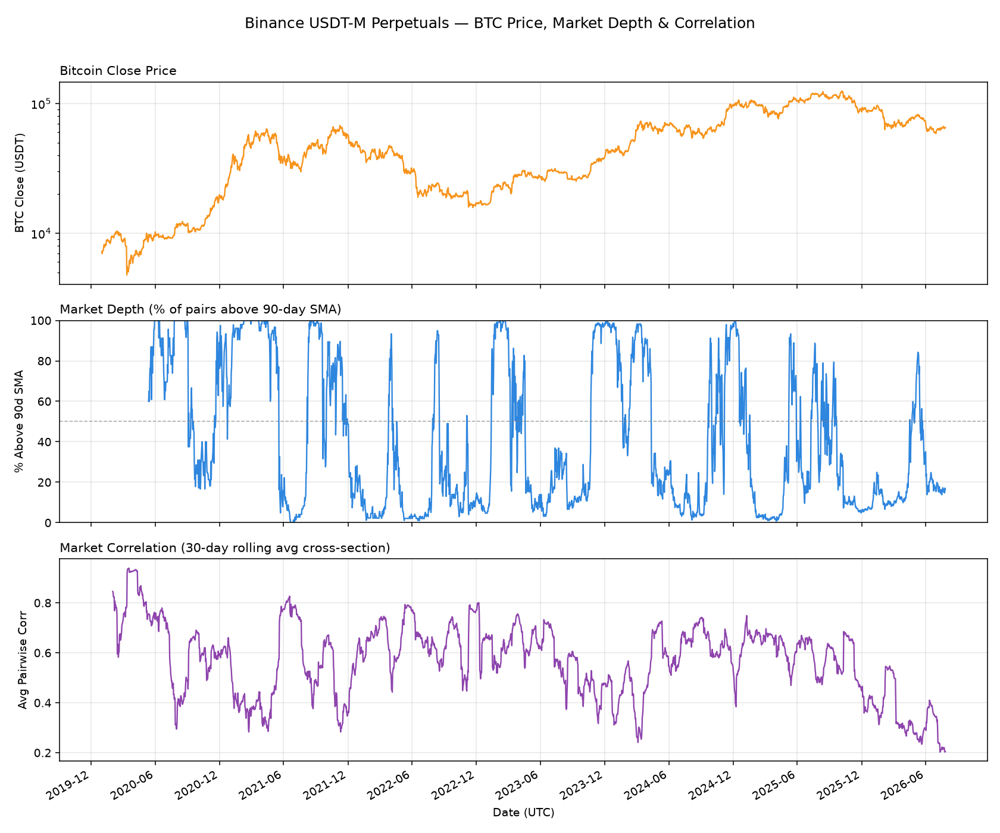

# Binance market breadth & correlation

- **Universe:** Binance USDT-M perpetual futures (618 pairs)
- **Data:** `data/binance/binance_futures_ohlcv_1d.parquet`
- **Range:** 2020-01-01 → 2026-07-27

## Latest readings

| Indicator | Value |
|-----------|-------|
| BTC close | 65,140.00 |
| Market depth (% > 90d SMA) | 16.5% |
| Market correlation (30d avg) | 0.204 |

