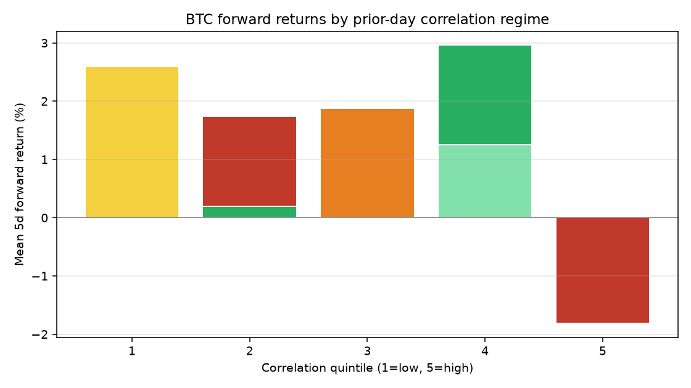
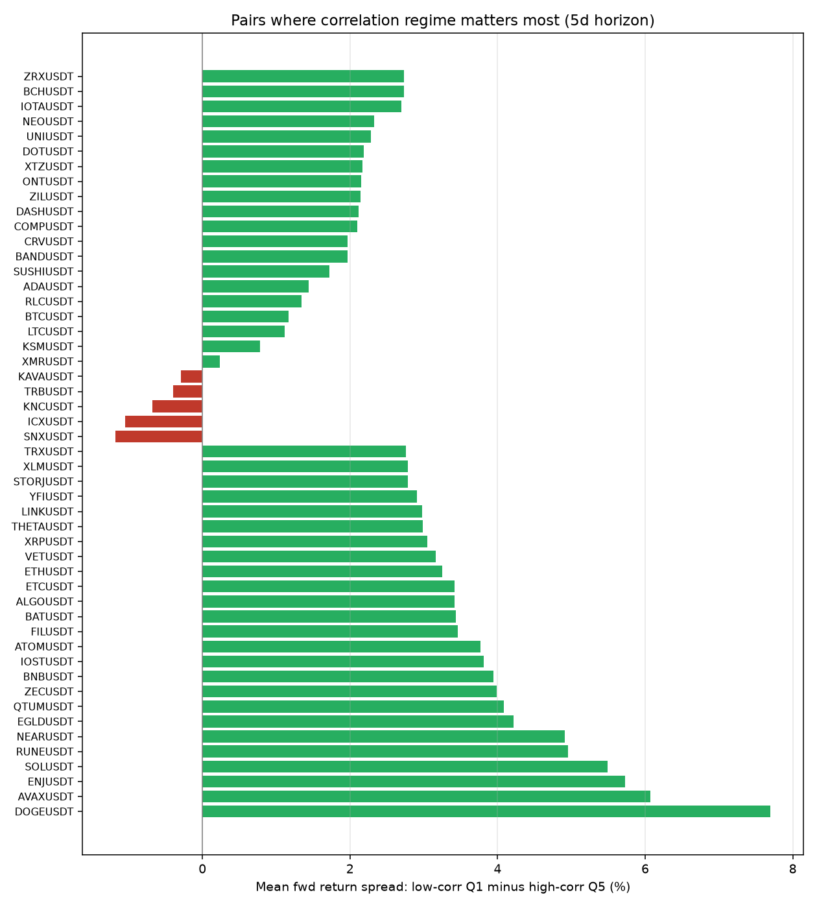
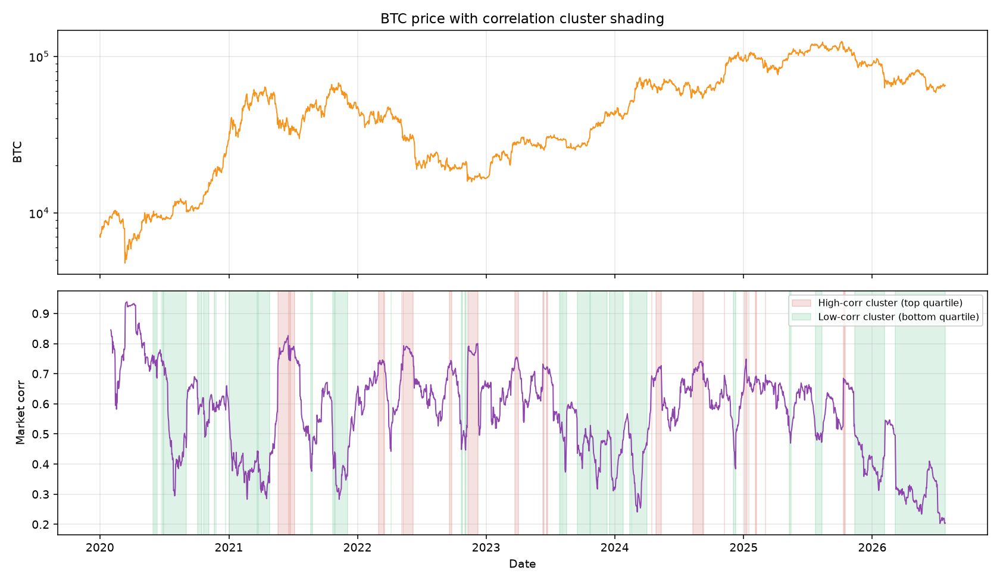

# Correlation clustering & directional signal study

## What happens when correlations cluster?

When **market correlation rises into the top quintile**, returns become highly synchronized — typical of liquidation cascades, macro shocks, and beta compression across alts. **Low-correlation clusters** (bottom quintile) are dispersion regimes where pairs diverge from BTC.

## BTC directional signal (5d forward, 1-bar lag)

| Quintile | IS mean 5d fwd | OOS mean 5d fwd |
|----------|----------------|-----------------|
| Q1 (low corr) | +1.34% | -0.60% |
| Q2 (mid corr) | +0.80% | -0.24% |
| Q3 (mid corr) | +1.00% | +0.06% |
| Q4 (mid corr) | +1.25% | +0.15% |
| Q5 (high corr) | -0.53% | +nan% |

**IS Q1−Q5 spread:** +1.87%
**OOS Q1−Q5 spread:** -0.60%

## Pairs with strongest regime signal (5d, Q1−Q5 spread)

### Outperform in low-corr / underperform in high-corr

| Pair | Spread | t-stat | Median β |
|------|--------|--------|----------|
| DOGEUSDT | +7.70% | 2.26 | 1.20 |
| AVAXUSDT | +6.07% | 3.63 | 1.25 |
| ENJUSDT | +5.73% | 3.09 | 1.22 |
| SOLUSDT | +5.49% | 4.62 | 1.24 |
| RUNEUSDT | +4.96% | 3.69 | 1.44 |
| NEARUSDT | +4.91% | 4.11 | 1.33 |
| EGLDUSDT | +4.22% | 3.06 | 0.99 |
| QTUMUSDT | +4.08% | 3.60 | 1.12 |
| ZECUSDT | +3.99% | 3.07 | 1.07 |
| BNBUSDT | +3.94% | 3.23 | 0.83 |

### Opposite: hurt by low-corr / helped by high-corr (beta-like)

| Pair | Spread | t-stat | Median β |
|------|--------|--------|----------|
| RLCUSDT | +1.34% | 1.18 | 1.18 |
| BTCUSDT | +1.17% | 2.04 | nan |
| LTCUSDT | +1.12% | 1.42 | 1.04 |
| KSMUSDT | +0.78% | 0.70 | 1.15 |
| XMRUSDT | +0.24% | 0.29 | 0.76 |
| KAVAUSDT | -0.30% | -0.25 | 1.08 |
| TRBUSDT | -0.40% | -0.28 | 1.31 |
| KNCUSDT | -0.68% | -0.60 | 1.05 |
| ICXUSDT | -1.05% | -0.89 | 1.15 |
| SNXUSDT | -1.18% | -1.14 | 1.29 |

### Full universe: pairs that favor *high*-correlation clusters

| Pair | Spread (Q1−Q5) | t-stat |
|------|----------------|--------|
| BELUSDT | -6.78% | -3.87 |
| SUPERUSDT | -5.36% | -2.58 |
| BIGTIMEUSDT | -4.82% | -1.83 |
| TNSRUSDT | -4.22% | -2.08 |
| 1000RATSUSDT | -4.22% | -1.41 |
| LQTYUSDT | -3.47% | -1.86 |
| MTLUSDT | -3.23% | -3.56 |
| BSVUSDT | -3.22% | -1.28 |
| C98USDT | -3.17% | -2.95 |
| MEWUSDT | -3.11% | -1.53 |

## Charts

