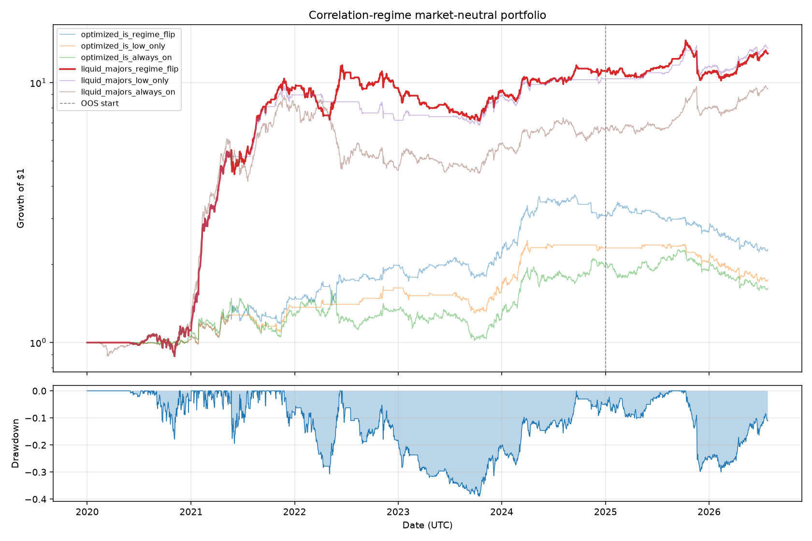

# Market-neutral correlation-regime portfolio

Dollar-neutral L/S book using correlation-regime insights. Baskets fixed from IS study; OOS is post-2025.

## Primary portfolio (liquid majors, regime_flip)

- **Long (dispersion winners):** SOLUSDT, AVAXUSDT, DOGEUSDT, NEARUSDT, RUNEUSDT, BNBUSDT, EGLDUSDT, QTUMUSDT, ZECUSDT, ENJUSDT
- **Short (cluster beneficiaries):** BELUSDT, SUPERUSDT, BIGTIMEUSDT, TNSRUSDT, C98USDT, MTLUSDT, LQTYUSDT, KASUSDT, MEWUSDT, ARKUSDT
- **Rules:** Q1–Q2 → long dispersion / short cluster; Q4–Q5 → reversed; Q3 → flat
- **Neutrality:** 50% gross long + 50% gross short when active; ~0 BTC beta

| Segment | Sharpe | CAGR | Max DD |
|---------|--------|------|--------|
| Full | 1.52 | 47.6% | -38.9% |
| In-sample | 1.73 | 61.8% | -38.9% |
| Out-of-sample | 0.60 | 10.1% | -30.0% |

BTC beta: 0.051

## IS-optimized basket variant (regime_flip)

| Segment | Sharpe | CAGR | Max DD |
|---------|--------|------|--------|
| In-sample | 1.09 | 25.2% | -19.1% |
| Out-of-sample | -0.93 | -17.5% | -35.7% |

