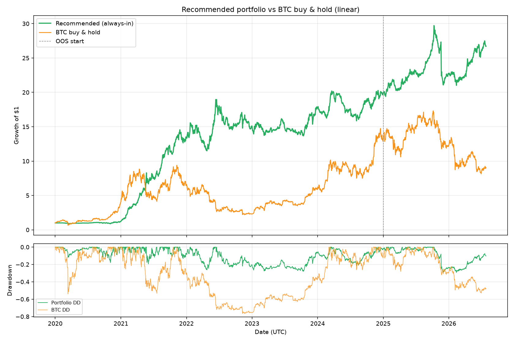

# Market-neutral correlation-regime portfolio

Dollar-neutral L/S book using correlation-regime insights. Baskets fixed from IS study; OOS is post-2025.

## Recommended: always-invested max-Sharpe

- **Long (dispersion winners):** SOLUSDT, AVAXUSDT, DOGEUSDT, NEARUSDT, RUNEUSDT, BNBUSDT, EGLDUSDT, QTUMUSDT, ZECUSDT, ENJUSDT
- **Short (cluster beneficiaries):** BELUSDT, SUPERUSDT, BIGTIMEUSDT, TNSRUSDT, C98USDT, MTLUSDT, LQTYUSDT, KASUSDT, MEWUSDT, ARKUSDT
- **Default:** long dispersion / short cluster (100% gross exposure)
- **Flip:** when correlation quintile ≥ Q3 **and** market depth below 35th percentile → reverse legs
- **Always in market:** no flat periods

| Segment | Sharpe | CAGR | Max DD |
|---------|--------|------|--------|
| Full | 1.77 | 64.8% | -29.3% |
| In-sample | 1.94 | 81.5% | -27.9% |
| Out-of-sample | 1.07 | 21.1% | -29.3% |

BTC beta: 0.073 | Avg gross exposure: 100%

## Prior variant: selective depth gate (higher OOS Sharpe, often flat)

| Segment | Sharpe | Max DD |
|---------|--------|--------|
| Full | 1.86 | -12.7% |
| Out-of-sample | 2.39 | -2.7% |

## Exports

- **vs BTC linear:** `charts/recommended_vs_btc_linear.png`
- **vs BTC log:** `charts/recommended_vs_btc_log.png`
- **vs BTC CSV:** `artifacts/recommended_vs_btc.csv`
- **Portfolio CSV:** `artifacts/recommended_equity.csv`
- Always-in sweep: `artifacts/always_in_market_sweep.json`

