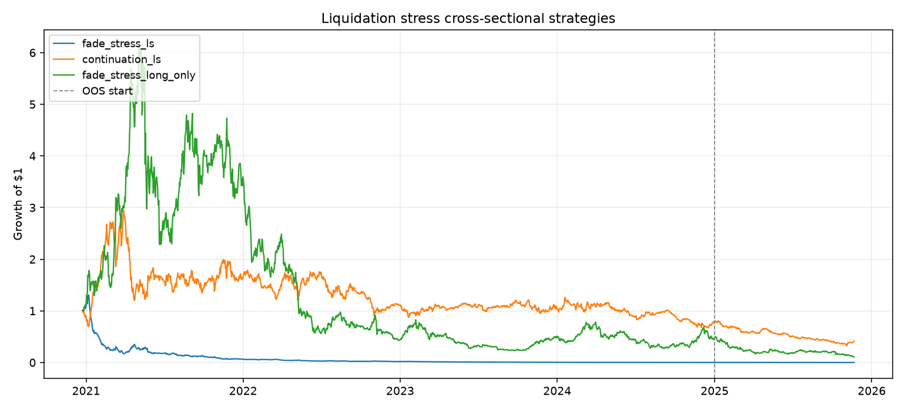
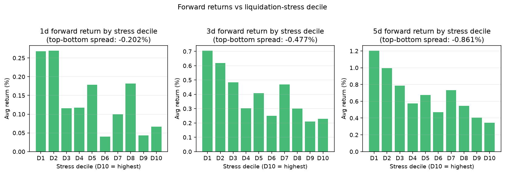
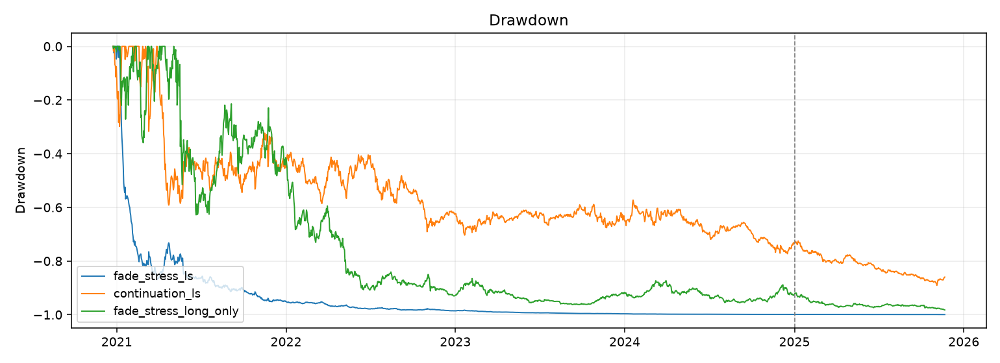

# Cross-sectional liquidation stress factor

- **Universe:** 296 Binance USDT-M perps with Coinglass funding/OI/liquidations
- **Sample:** 2020-12-24 → 2025-11-22 (avg 130 names/day)
- **OOS cut:** 2025-01-01

## Signal

Daily composite stress per symbol:
`stress = mean(cs_percentile(funding), cs_percentile(OI), cs_percentile(liq_z))`, lagged 1 bar.

**Hypothesis (fade):** highest-stress names mean-revert after a flush → long top decile / short bottom.

## Decile forward returns (full sample)

| Horizon | D1 (low stress) | D10 (high stress) | Top − Bottom |
| --- | --- | --- | --- |
| 1d | 0.268% | 0.066% | -0.202% |
| 3d | 0.705% | 0.229% | -0.477% |
| 5d | 1.204% | 0.343% | -0.861% |

## Tradable sleeves (daily rebalance, decile L/S)

### Fade stress (long crowded/flushed, short calm)
- Full-sample Sharpe: **-2.50**, CAGR: **-77.8%**, MaxDD: **-100.0%**
- IS Sharpe: -2.58 | OOS Sharpe: -2.30

### Continuation (inverse)
- Full-sample Sharpe: **-0.06**, CAGR: **-16.4%**, MaxDD: **-89.1%**
- IS Sharpe: 0.18 | OOS Sharpe: -2.07

## Gross returns (no fees/slippage)

| Sleeve | Full Sharpe | IS Sharpe | OOS Sharpe | CAGR | MaxDD |
| --- | --- | --- | --- | --- | --- |
| Fade stress L/S | -1.22 | -1.38 | -0.12 | -55.5% | -98.6% |
| Continuation L/S | 1.22 | 1.38 | 0.12 | 67.2% | -57.1% |
| Fade long-only | 0.35 | 0.64 | -1.15 | -10.1% | -91.5% |

## Charts

