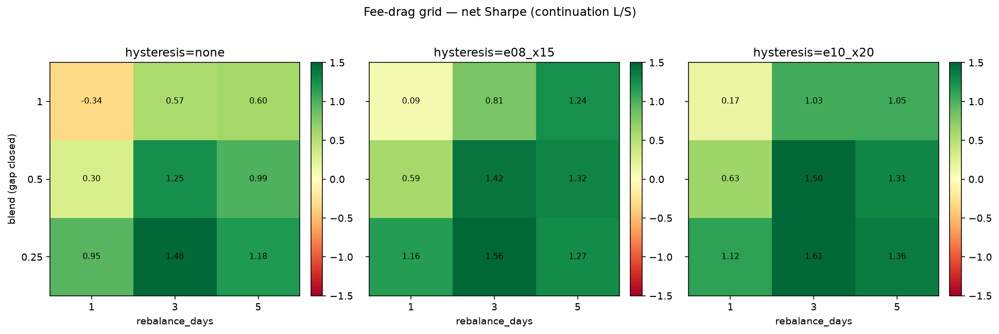
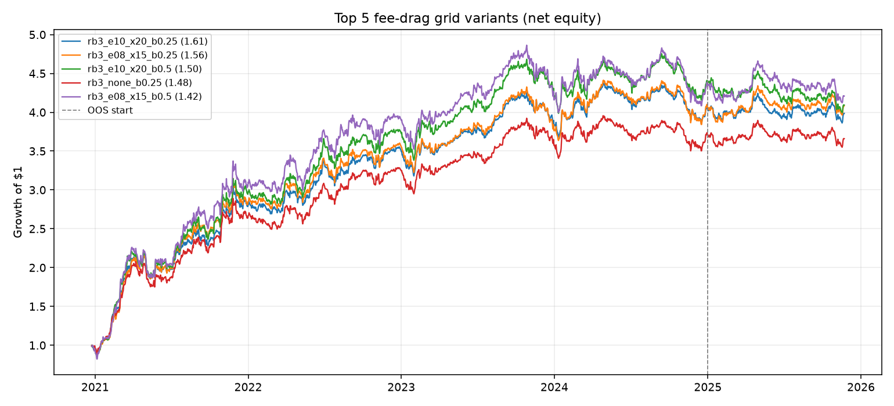

# Fee-drag grid — continuation L/S

Construction-only grid (signal unchanged): **rebalance lag × hysteresis bands × turnover-penalized sizing (blend toward target)**.

OOS cut: **2025-01-01**. Costs: fee 0.00045, slippage 0.0005 on actual turnover.
Grid size: **27** configs.

## Headline

- Baseline `rb1_none_b1`: net Sharpe **-0.34**, gross **1.20**, ann. turnover **439x**
- Best `rb3_e10_x20_b0.25`: net Sharpe **1.61**, gross **1.80**, IS/OOS net **1.85 / -0.12**, ann. turnover **38x**
- Gross Sharpe retained vs baseline: **150%**

## Top 10 by net Sharpe

| Rank | Variant | Net Sharpe | IS Net | OOS Net | Gross Sharpe | Net CAGR | MaxDD | Ann. TO |
| --- | --- | --- | --- | --- | --- | --- | --- | --- |
| 1 | `rb3_e10_x20_b0.25` | 1.61 | 1.85 | -0.12 | 1.80 | 32.5% | -14.1% | 38x |
| 2 | `rb3_e08_x15_b0.25` | 1.56 | 1.76 | 0.10 | 1.76 | 33.1% | -15.9% | 41x |
| 3 | `rb3_e10_x20_b0.5` | 1.50 | 1.79 | -0.66 | 1.82 | 33.2% | -16.0% | 69x |
| 4 | `rb3_none_b0.25` | 1.48 | 1.70 | -0.08 | 1.70 | 30.2% | -15.7% | 44x |
| 5 | `rb3_e08_x15_b0.5` | 1.42 | 1.64 | -0.27 | 1.74 | 33.9% | -17.9% | 76x |
| 6 | `rb5_e10_x20_b0.25` | 1.36 | 1.55 | 0.04 | 1.49 | 24.5% | -16.3% | 23x |
| 7 | `rb5_e08_x15_b0.5` | 1.32 | 1.43 | 0.62 | 1.54 | 28.4% | -18.8% | 48x |
| 8 | `rb5_e10_x20_b0.5` | 1.31 | 1.51 | -0.11 | 1.53 | 25.4% | -18.3% | 44x |
| 9 | `rb5_e08_x15_b0.25` | 1.27 | 1.39 | 0.48 | 1.40 | 23.2% | -17.4% | 25x |
| 10 | `rb3_none_b0.5` | 1.25 | 1.47 | -0.45 | 1.63 | 28.1% | -18.6% | 86x |

## Full ranking

| Rank | Variant | Net Sharpe | IS Net | OOS Net | Gross Sharpe | Net CAGR | MaxDD | Ann. TO |
| --- | --- | --- | --- | --- | --- | --- | --- | --- |
| 1 | `rb3_e10_x20_b0.25` | 1.61 | 1.85 | -0.12 | 1.80 | 32.5% | -14.1% | 38x |
| 2 | `rb3_e08_x15_b0.25` | 1.56 | 1.76 | 0.10 | 1.76 | 33.1% | -15.9% | 41x |
| 3 | `rb3_e10_x20_b0.5` | 1.50 | 1.79 | -0.66 | 1.82 | 33.2% | -16.0% | 69x |
| 4 | `rb3_none_b0.25` | 1.48 | 1.70 | -0.08 | 1.70 | 30.2% | -15.7% | 44x |
| 5 | `rb3_e08_x15_b0.5` | 1.42 | 1.64 | -0.27 | 1.74 | 33.9% | -17.9% | 76x |
| 6 | `rb5_e10_x20_b0.25` | 1.36 | 1.55 | 0.04 | 1.49 | 24.5% | -16.3% | 23x |
| 7 | `rb5_e08_x15_b0.5` | 1.32 | 1.43 | 0.62 | 1.54 | 28.4% | -18.8% | 48x |
| 8 | `rb5_e10_x20_b0.5` | 1.31 | 1.51 | -0.11 | 1.53 | 25.4% | -18.3% | 44x |
| 9 | `rb5_e08_x15_b0.25` | 1.27 | 1.39 | 0.48 | 1.40 | 23.2% | -17.4% | 25x |
| 10 | `rb3_none_b0.5` | 1.25 | 1.47 | -0.45 | 1.63 | 28.1% | -18.6% | 86x |
| 11 | `rb5_e08_x15_b1` | 1.24 | 1.34 | 0.61 | 1.55 | 33.9% | -22.6% | 88x |
| 12 | `rb5_none_b0.25` | 1.18 | 1.36 | -0.09 | 1.33 | 21.2% | -17.3% | 27x |
| 13 | `rb1_e08_x15_b0.25` | 1.16 | 1.32 | -0.04 | 1.64 | 25.3% | -21.7% | 109x |
| 14 | `rb1_e10_x20_b0.25` | 1.12 | 1.33 | -0.51 | 1.60 | 22.3% | -20.2% | 100x |
| 15 | `rb5_e10_x20_b1` | 1.05 | 1.25 | -0.36 | 1.38 | 24.1% | -21.1% | 79x |
| 16 | `rb3_e10_x20_b1` | 1.03 | 1.29 | -0.99 | 1.52 | 24.9% | -24.6% | 125x |
| 17 | `rb5_none_b0.5` | 0.99 | 1.17 | -0.30 | 1.25 | 19.6% | -21.0% | 53x |
| 18 | `rb1_none_b0.25` | 0.95 | 1.16 | -0.64 | 1.51 | 19.1% | -21.2% | 121x |
| 19 | `rb3_e08_x15_b1` | 0.81 | 0.96 | -0.42 | 1.28 | 20.5% | -28.3% | 139x |
| 20 | `rb1_e10_x20_b0.5` | 0.63 | 0.86 | -1.16 | 1.44 | 11.6% | -27.8% | 179x |
| 21 | `rb5_none_b1` | 0.60 | 0.78 | -0.83 | 0.97 | 13.3% | -32.8% | 103x |
| 22 | `rb1_e08_x15_b0.5` | 0.59 | 0.75 | -0.64 | 1.41 | 11.6% | -28.0% | 198x |
| 23 | `rb3_none_b1` | 0.57 | 0.72 | -0.68 | 1.13 | 12.7% | -30.4% | 166x |
| 24 | `rb1_none_b0.5` | 0.30 | 0.51 | -1.47 | 1.28 | 4.3% | -41.6% | 231x |
| 25 | `rb1_e10_x20_b1` | 0.17 | 0.45 | -2.08 | 1.44 | 1.1% | -51.6% | 316x |
| 26 | `rb1_e08_x15_b1` | 0.09 | 0.30 | -1.61 | 1.34 | -1.3% | -52.2% | 356x |
| 27 | `rb1_none_b1` | -0.34 | -0.09 | -2.47 | 1.20 | -12.0% | -73.2% | 439x |

## Charts

