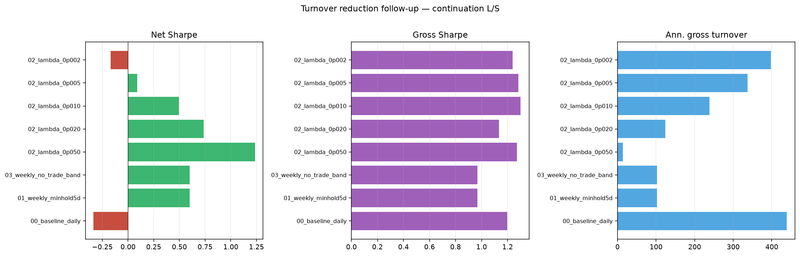

# Turnover reduction follow-up — continuation L/S

OOS cut: **2025-01-01**. Costs: fee 0.00045, slippage 0.0005 (on actual daily turnover).

## Primary tests (vs baseline)

| Variant | Net Sharpe | Net CAGR | Net MaxDD | Gross Sharpe | Gross CAGR | IS Net Sharpe | OOS Net Sharpe | Ann. turnover |
| --- | --- | --- | --- | --- | --- | --- | --- | --- |
| 00_baseline_daily | -0.34 | -12.0% | -73.2% | 1.20 | 33.4% | -0.09 | -2.47 | 439x |
| 01_weekly_minhold5d | 0.60 | 13.3% | -32.8% | 0.97 | 24.9% | 0.78 | -0.83 | 103x |
| 03_weekly_no_trade_band | 0.60 | 13.3% | -32.8% | 0.97 | 24.9% | 0.79 | -0.83 | 103x |

## λ sweep (turnover-penalized optimizer, daily)

| Variant | Net Sharpe | Net CAGR | Net MaxDD | Gross Sharpe | Gross CAGR | IS Net Sharpe | OOS Net Sharpe | Ann. turnover |
| --- | --- | --- | --- | --- | --- | --- | --- | --- |
| 02_lambda_0p050 | 1.23 | 43.9% | -46.5% | 1.27 | 45.8% | 1.39 | -0.08 | 14x |
| 02_lambda_0p020 | 0.74 | 19.0% | -40.2% | 1.13 | 33.9% | 0.81 | 0.24 | 124x |
| 02_lambda_0p010 | 0.49 | 10.4% | -37.3% | 1.30 | 38.5% | 0.44 | 0.78 | 239x |
| 02_lambda_0p005 | 0.09 | -1.2% | -56.0% | 1.28 | 36.0% | 0.18 | -0.54 | 337x |
| 02_lambda_0p002 | -0.17 | -7.9% | -67.3% | 1.24 | 34.4% | 0.02 | -1.73 | 398x |

## Variant descriptions

- **00_baseline_daily**: Daily decile L/S continuation (reference)
- **01_weekly_minhold5d**: Weekly rebalance (5d) + 5-day minimum hold per name
- **03_weekly_no_trade_band**: Weekly rebalance + 0.5% per-name no-trade band
- **02_lambda_0p050**: Daily turnover-penalized optimizer (λ=0.05)
- **02_lambda_0p020**: Daily turnover-penalized optimizer (λ=0.02)
- **02_lambda_0p010**: Daily turnover-penalized optimizer (λ=0.01)
- **02_lambda_0p005**: Daily turnover-penalized optimizer (λ=0.005)
- **02_lambda_0p002**: Daily turnover-penalized optimizer (λ=0.002)

Best λ variant: **02_lambda_0p050** (net Sharpe 1.23, turnover 14x)

