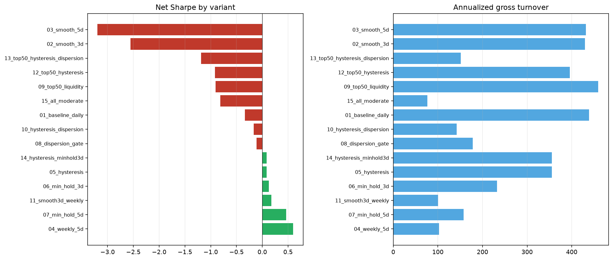

# Turnover reduction sweep — continuation L/S

OOS cut: **2025-01-01**. Costs: fee 0.00045, slippage 0.0005 (applied on actual daily turnover).

| Variant | Net Sharpe | Net CAGR | Net MaxDD | Gross Sharpe | OOS Net Sharpe | Ann. turnover |
| --- | --- | --- | --- | --- | --- | --- |
| 04_weekly_5d | 0.60 | 13.3% | -32.8% | 0.97 | -0.83 | 103x |
| 07_min_hold_5d | 0.46 | 7.4% | -23.1% | 1.23 | -1.03 | 158x |
| 11_smooth3d_weekly | 0.18 | 1.6% | -36.7% | 0.80 | -0.64 | 100x |
| 06_min_hold_3d | 0.13 | 0.4% | -40.4% | 1.12 | -1.32 | 232x |
| 05_hysteresis | 0.09 | -1.3% | -52.2% | 1.34 | -1.61 | 356x |
| 14_hysteresis_minhold3d | 0.09 | -1.3% | -52.2% | 1.34 | -1.61 | 356x |
| 08_dispersion_gate | -0.11 | -5.6% | -42.5% | 0.57 | -0.85 | 178x |
| 10_hysteresis_dispersion | -0.16 | -6.9% | -37.6% | 0.38 | -0.62 | 142x |
| 01_baseline_daily | -0.34 | -12.0% | -73.2% | 1.20 | -2.47 | 439x |
| 15_all_moderate | -0.82 | -26.5% | -84.6% | -0.59 | -1.03 | 77x |
| 09_top50_liquidity | -0.91 | -35.1% | -94.4% | 0.21 | -2.20 | 460x |
| 12_top50_hysteresis | -0.92 | -34.6% | -94.2% | 0.06 | -2.57 | 396x |
| 13_top50_hysteresis_dispersion | -1.19 | -38.3% | -90.7% | -0.78 | -3.26 | 151x |
| 02_smooth_3d | -2.56 | -28.5% | -82.1% | 0.63 | -3.42 | 430x |
| 03_smooth_5d | -3.20 | -30.2% | -84.2% | 0.51 | -3.01 | 432x |

## Variant descriptions

- **01_baseline_daily**: Daily decile L/S continuation
- **02_smooth_3d**: 3-day rolling mean on stress
- **03_smooth_5d**: 5-day rolling mean on stress
- **04_weekly_5d**: Rebalance every 5 trading days
- **05_hysteresis**: Enter top/bottom 8%, exit outside 15%
- **06_min_hold_3d**: Minimum 3-day hold per name
- **07_min_hold_5d**: Minimum 5-day hold per name
- **08_dispersion_gate**: Trade only when xs stress std > expanding median
- **09_top50_liquidity**: Universe restricted to top-50 20d quote volume
- **10_hysteresis_dispersion**: Hysteresis + dispersion gate
- **11_smooth3d_weekly**: 3-day smooth + weekly rebalance
- **12_top50_hysteresis**: Top-50 liquidity + hysteresis
- **13_top50_hysteresis_dispersion**: Top-50 + hysteresis + dispersion gate
- **14_hysteresis_minhold3d**: Hysteresis + 3-day minimum hold
- **15_all_moderate**: Top-50 + smooth3d + hysteresis + dispersion (no weekly)

